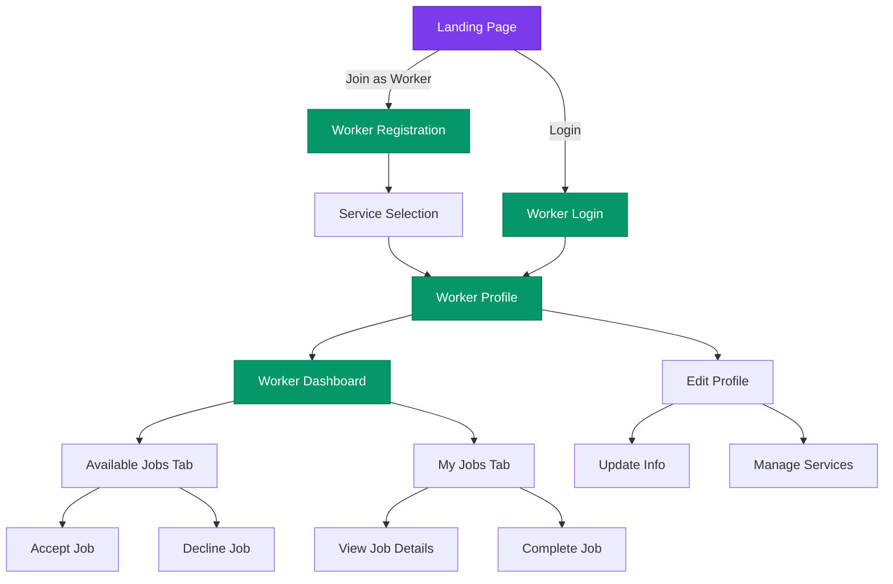
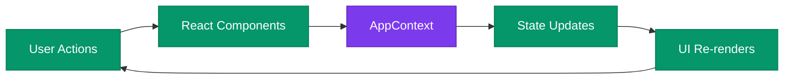
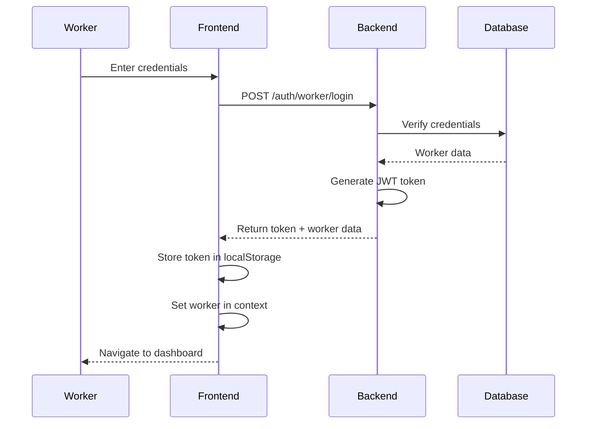

# Worker Portal Architecture

## System Architecture Diagram



---

## Component Hierarchy

```
App.jsx
├── AppProvider (Context)
│   ├── user state
│   ├── currentPage state
│   ├── navigate function
│   └── showToast function
│
├── Navbar
│   └── Worker Portal Link
│
├── Router
│   ├── WorkerLoginPage
│   ├── WorkerRegisterPage
│   ├── WorkerProfilePage
│   ├── EditWorkerProfilePage
│   └── WorkerDashboardPage
│
└── Toast
└── BottomNav
└── Footer
```

---

## Data Flow Diagram



---

## State Management

### AppContext State
```javascript
{
  // Navigation
  currentPage: 'workerProfile',
  navigate: (page, data) => {},
  
  // User Data
  user: { ...mockUser },
  setUser: (userData) => {},
  
  // Bookings/Jobs
  bookings: [...mockBookings],
  addBooking: (booking) => {},
  
  // UI State
  toast: { message, type },
  showToast: (message, type) => {},
  isLoading: false,
  
  // Search & Filters
  searchQuery: '',
  selectedCategory: null,
  selectedService: null,
}
```

### Worker-Specific State (Local)
```javascript
// WorkerRegisterPage
const [selectedServices, setSelectedServices] = useState([])

// WorkerProfilePage
const [workerData] = useState({
  ...user,
  services: [1, 2, 3],
  rating: '4.8',
  completedJobs: 127,
  totalEarnings: '₹45,200',
  availability: 'Available',
  experience: '3 years',
  hourlyRate: '₹500/hr'
})

// EditWorkerProfilePage
const [formData, setFormData] = useState({
  name, email, phone, address,
  experience, hourlyRate, bio
})

// WorkerDashboardPage
const [activeTab, setActiveTab] = useState('available')
const [availableJobs, setAvailableJobs] = useState([...])
const [acceptedJobs, setAcceptedJobs] = useState([...])
```

---

## Routing Structure

```
/ (Landing)
├── /worker/login
├── /worker/register
├── /worker/profile
├── /worker/profile/edit
└── /worker/dashboard
```

### Route Guards (Future Implementation)
```javascript
// Pseudo-code for protected routes
<Route 
  path="/worker/*" 
  element={
    <RequireAuth>
      <RequireWorkerRole>
        <WorkerLayout />
      </RequireWorkerRole>
    </RequireAuth>
  }
/>
```

---

## API Integration Points

### Authentication
```javascript
POST /api/auth/worker/login
POST /api/auth/worker/register
POST /api/auth/worker/logout
GET  /api/auth/worker/me
```

### Profile Management
```javascript
GET    /api/worker/profile
PUT    /api/worker/profile
POST   /api/worker/services
DELETE /api/worker/services/:id
```

### Job Management
```javascript
GET    /api/worker/jobs/available
GET    /api/worker/jobs/accepted
POST   /api/worker/jobs/:id/accept
POST   /api/worker/jobs/:id/decline
PUT    /api/worker/jobs/:id/status
GET    /api/worker/jobs/:id/details
```

### Earnings & Analytics
```javascript
GET /api/worker/earnings
GET /api/worker/analytics/overview
GET /api/worker/reviews
```

---

## File Dependencies

```
WorkerLoginPage.jsx
├── AppContext
├── Icon
└── useApp hook

WorkerRegisterPage.jsx
├── AppContext
├── Icon
├── CATEGORIES (mockData)
└── useApp hook

WorkerProfilePage.jsx
├── AppContext
├── Icon
├── CATEGORIES (mockData)
└── useApp hook

EditWorkerProfilePage.jsx
├── AppContext
├── Icon
├── CATEGORIES (mockData)
└── useApp hook

WorkerDashboardPage.jsx
├── AppContext
├── Icon
├── SERVICES (mockData)
└── useApp hook
```

---

## UI Component Tree

```
WorkerProfilePage
├── Profile Header Card
│   ├── Avatar
│   ├── Name & Email
│   ├── Status Badges
│   └── Edit Button
│
├── Stats Grid
│   ├── Jobs Done Card
│   ├── Earnings Card
│   └── Rating Card
│
├── Services Section
│   ├── Section Header
│   ├── Service Cards (2-col grid)
│   └── Edit Services Button
│
└── Menu List
    ├── My Jobs Item
    ├── Availability Item
    ├── Earnings Item
    ├── Notifications Item
    ├── Help Item
    └── About Item
```

---

## Styling Strategy

### Theme Colors
```javascript
// Worker Portal Theme
const workerTheme = {
  primary: {
    light: '#6ee7b7',  // emerald-300
    DEFAULT: '#059669', // emerald-600
    dark: '#047857',    // emerald-700
  },
  secondary: {
    light: '#5eead4',   // teal-300
    DEFAULT: '#0d9488', // teal-600
    dark: '#0f766e',    // teal-700
  },
  backgrounds: {
    gradient: 'from-emerald-50 to-teal-50',
    card: 'bg-white',
    accent: 'bg-emerald-50',
  }
}
```

### Tailwind Classes Pattern
```jsx
// Primary Button
className="px-6 py-3 bg-gradient-to-r from-emerald-600 to-teal-600 
           text-white rounded-xl font-semibold 
           hover:shadow-lg hover:shadow-emerald-500/30 
           transition-all"

// Secondary Button
className="px-6 py-3 bg-gray-100 text-gray-700 
           rounded-xl font-semibold 
           hover:bg-gray-200 transition-colors"

// Card
className="bg-white rounded-2xl border border-gray-100 
           p-6 shadow-sm hover:shadow-md transition-shadow"

// Input Field
className="w-full px-4 py-3 bg-gray-50 rounded-xl 
           border border-gray-200 text-sm 
           focus:outline-none focus:ring-2 focus:ring-emerald-500"
```

---

## Security Considerations (Future)

### Authentication Flow


### Protected Routes
- Verify JWT token on each request
- Check worker role authorization
- Validate service permissions
- Rate limiting for API calls

---

## Performance Optimizations

### Code Splitting (Future)
```javascript
// Lazy load worker pages
const WorkerLoginPage = lazy(() => import('../pages/WorkerLoginPage'))
const WorkerRegisterPage = lazy(() => import('../pages/WorkerRegisterPage'))
const WorkerProfilePage = lazy(() => import('../pages/WorkerProfilePage'))
const WorkerDashboardPage = lazy(() => import('../pages/WorkerDashboardPage'))

// Wrap in Suspense
<Suspense fallback={<Loader />}>
  <Routes>
    <Route path="/worker/login" element={<WorkerLoginPage />} />
    {/* ... other routes */}
  </Routes>
</Suspense>
```

### Memoization
```javascript
// Memoize expensive calculations
const workerServices = useMemo(() => 
  CATEGORIES.filter(cat => workerData.services.includes(cat.id)),
  [workerData.services]
)

// Callback memoization
const handleAcceptJob = useCallback((jobId) => {
  // handler logic
}, [showToast, navigate])
```

---

## Testing Strategy

### Unit Tests
```javascript
describe('WorkerRegisterPage', () => {
  test('allows selecting multiple services', () => {})
  test('validates at least one service is selected', () => {})
  test('submits registration form successfully', () => {})
})

describe('WorkerDashboardPage', () => {
  test('displays available jobs correctly', () => {})
  test('handles job acceptance', () => {})
  test('handles job declination', () => {})
  test('switches between tabs', () => {})
})
```

### Integration Tests
```javascript
describe('Worker Portal Flow', () => {
  test('complete registration to dashboard flow', () => {
    // 1. Visit landing
    // 2. Click "Join as Worker"
    // 3. Fill registration form
    // 4. Select services
    // 5. Submit and verify redirect
    // 6. Navigate to dashboard
    // 7. Accept a job
  })
})
```

---

## Deployment Checklist

- [ ] Environment variables configured
- [ ] Backend API endpoints ready
- [ ] Authentication implemented
- [ ] Database schemas created
- [ ] API rate limiting configured
- [ ] Error handling implemented
- [ ] Loading states added
- [ ] Mobile responsiveness tested
- [ ] Cross-browser testing done
- [ ] Accessibility audit passed
- [ ] Performance metrics acceptable
- [ ] SEO optimized (if public pages)
- [ ] Analytics integrated
- [ ] Error monitoring setup
- [ ] Documentation complete

---

**This architecture provides a solid foundation for scaling the worker portal!** 🚀
